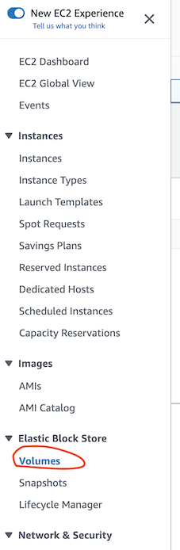
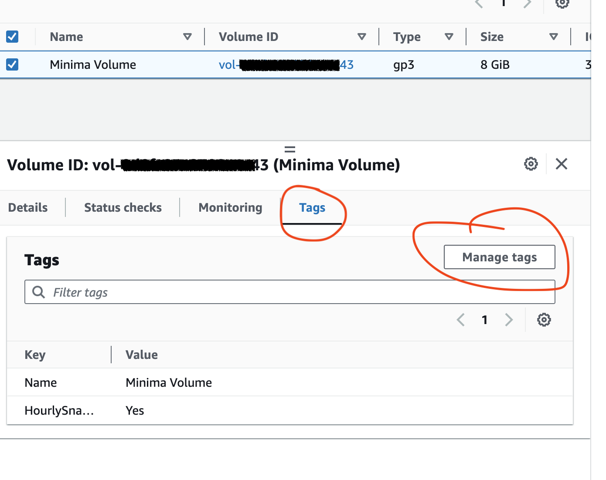
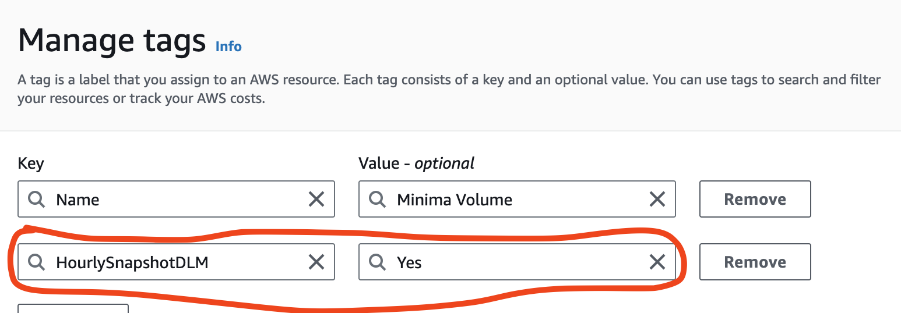

[Introduction](../index.md) > [Step 1](../step1/index.md) > Step 2 > Step 3

# Step 1 - Tag your EBS for the DLM policy

Assuming you have:

1. Logged into AWS console
2. Navigated to EC2 Dashboard
3. Selected the region your EC2 running Minima is running in.

Find the EBS volumes menu item and click it.

1. Select your Minima node volume from the table
2. Select the Tags tab in the details panel
3. Hit Manage tags

Then, add a tag for use in the next step, the DLM policy target.

The key should describe what the DLM policy is doing. For me I'm backing up every hour so my key is HourlySnapshotDLM with a value of Yes. You can chose your backup or snaphot frequency and create a tag accordingly.

Remember to hit the orange Save button before moving on to the next step.

[Goto step 2 - Create a DLM or Data Lifecycle Manager Policy](../step2/index.md)
