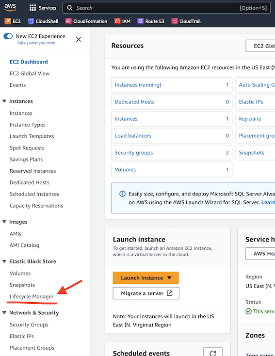

[Introduction](../index.md) > [Step 1](../step1/index.md) > <u>Step 2</u> > *Step 3*

# Step 2 - Tag your EBS for the DLM policy

Assuming you have logged into AWS console, and navigated to EC2 Dashboard. Locate the Elastic Block Store section and click Lifecycle Manager.

