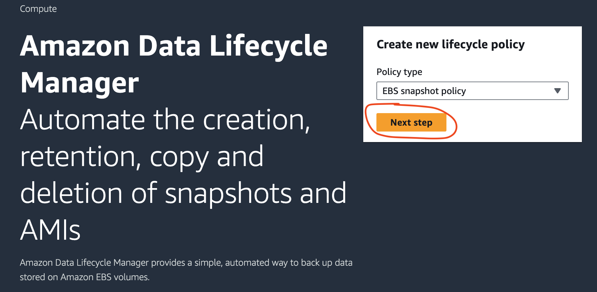
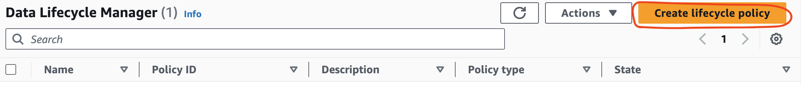
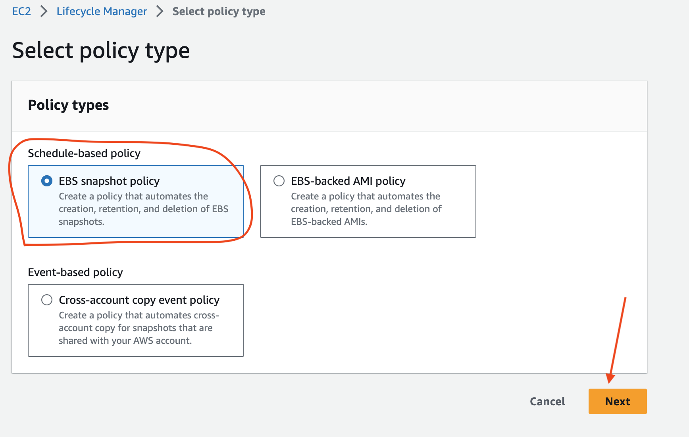
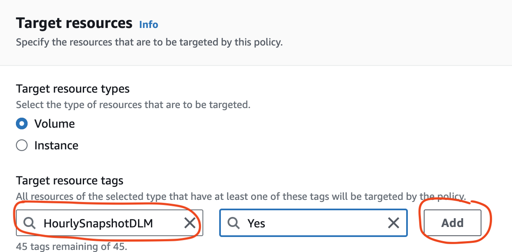
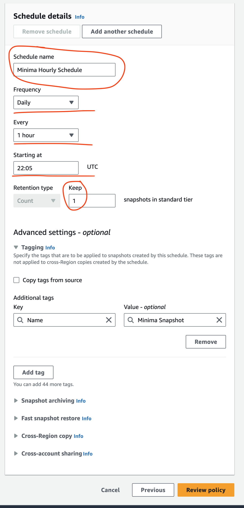
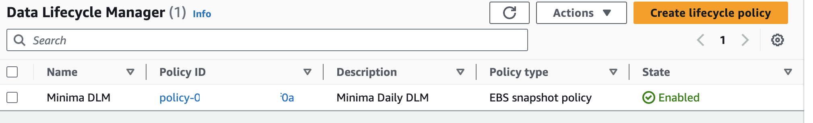

[Introduction](../index.md) > [Step 1](../step1/index.md) > <u>Step 2</u> > _Step 3_

# Step 2 - Create a Data Lifecycle Manager Policy

Located the Elastic Block Store section and click Lifecycle Manager.

You will either see the default landing page

If this is what you see, keep the EBS Snaphot Policy selected, and hit Next

Or
If you see the DLM table

Selected the Create lifecycle policy button. Which opens the Select policy type screen.

Scheduled-based policy and EBS snaphot policy is what you need...then hit Next

To create a DLM there are 3 steps. Specific settings -> Schedule -> Review.

## DLM Step 1 - Specific settings

There will be [at the time of writing this guide] 5 sections in this step.

1. Target resouces
2. Description
3. IAM role
4. Tags
5. Policy status

Let's walk through each.

### Target resources

- Keep Volume as the resource type
- Selected the tag you associated with your volume from the search box
- Don't forget to Add

The tag name should be unique to your node if you want to target only your node's volume for a snapshot/backup.

### Description

Give your policy a sensible description. eg. Minima Daily DLM or Minima weekly DLM or what ever frequency you will be backing up.

### IAM role

The default is good enough for this guide; creating a specific role is beyond this guide but worth looking into if you want to follow leading practices like [least privilege security model](https://en.wikipedia.org/wiki/Principle_of_least_privilege).

### Tags

Again, default is good enough, but I like to add a Name tag with a sensible value.

### Policy status

Another default, which means the policy will go live immediately after completion.

## DLM Step 2 - Configure schedule

This step is all about how often your snapshot will be performed.
For my example I have selected:

- Everyday or Daily in the frequency dropdown
- Every hour
- Starting at 22:05 UTC
- And I keep 1 snapshot

The time is when it first kicks off. We will want to put that 10 - 15 minutes ahead of the current UTC. You can check that [here](https://www.utctime.net/)

The last setting is the Rention value.

For my example I use a count of 1. Which means AWS will keep the last snapshot; when a new snapshot is taken an hour later, the old snapshot is automatically delete.

You can chose a different rention period if you like. Just remember snapshots cost money in AWS.

The other settings in the Configure schedule wizard are optional and beyond the scope of this guide.

Hit the orange Review button.

The last step is a review of your values. Double check the values and if you are happy hit the orange Create policy button.

You will now see a Data Lifecycle policy in the manager table.

[Goto step 3 - Confirm your snapshot is created](../step3/index.md)
