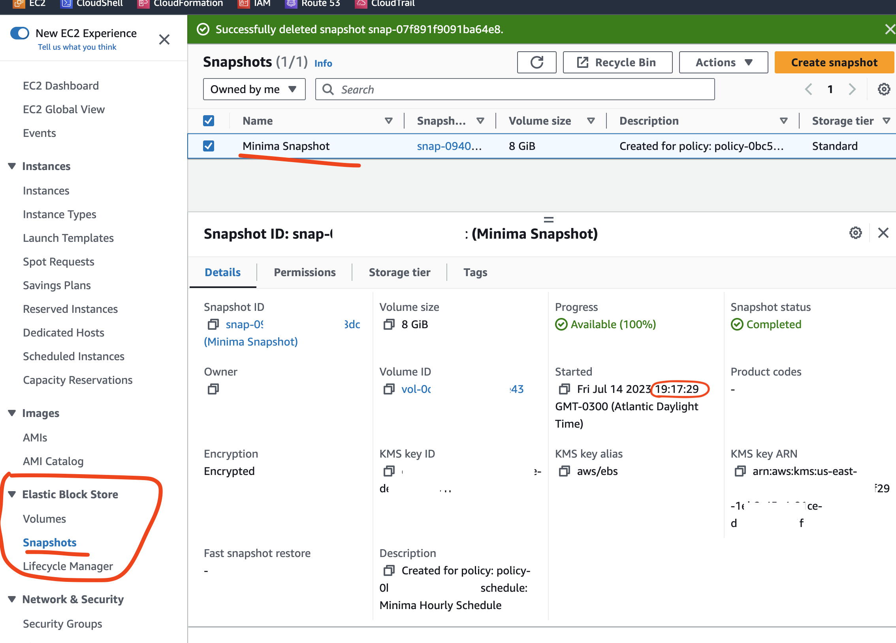

[Introduction](../index.md) > [Step 1](../step1/index.md) > [Step 2](../step2/index.md) > <u>Step 3</u>

# Step 3 - Confirm your snapshot is created

It can take longer than you might expect for the snapshot to appear. If you remember I configured my trigger to be 5 past the hour. But it takes 15-20 minutes after that for my snapshot to appear in the snapshot table.

That's it...no sweat.

Your minima node volume is now snapshot'ed every [insert your schedule] If the EC2 instance dies you can use this snapshot to bring back your node.

[How? That's the next guide!]
