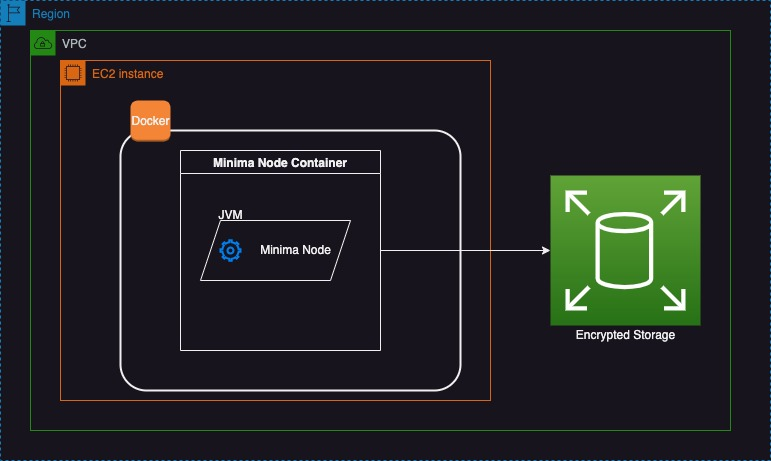

WARNING

_This document assumes that you have an AWS account, and that account is secured with the leading practices [_[_Read and follow these instructions from AWS_](https://docs.aws.amazon.com/accounts/latest/reference/welcome-first-time-user.html)_]_ That you understand that this document may contain errors which puts your value at risk. That this document will not age well and may not be kept up to date with the latest requirements that keeps your safe and your value secure.

_What do I mean by the above paragraph?_

_You, not me, not this document, or any other information you read online is responsible for protecting yourself, just you! You need to take responsibility for your actions, especially when value is at risk._

YOU HAVE BEEN WARNED

# INTRODUCTION - Running a Minima Node on AWS EC2 Resource

There are [many ways](https://docs.minima.global/docs/runanode/get_started) to run a Minima Node. This document will describe how to run a node using AWS EC2 Resource. I’ll walk through the steps for someone with basic or limited AWS knowledge.

_[Yes I see the irony of running a highly distributed technology on a highly centralised service like AWS]_

This is a basic diagram of what we are going to achieve.

As you can see, this a lot for something so small and lightweight as Minima. The benefits come from the convenience of managed hardware, and security AWS can provides but those benefits require trusting AWS. 

## What does AWS provide

When you use AWS you are leasing AWS’s resources [the cloud] This is an alternative to owning a device like a mobile or a home computer and running your node on that device.

Minima is small, so you don’t need a powerful EC2 instance, a small t2.micro is enough. At the time of writing this an EC2 t2.micro instance with 8GiB storage will cost about $34USD per year. That’s pretty cheap compared to other options to run a node. E.g. Budget android phone is about $140USD

You get a lot for that $34 pa.  AWS data centres are highly secure [[Here](https://aws.amazon.com/compliance/data-center/controls/)] You can create backups of your data. Using AWS is highly flexible, secure, and can be scripted and programmed in many many ways. 

## About this guide

This guide is as simple as I can make it. But that doesn’t mean you can set and forget. You need to learn more, and understand each part of this guide. As the end of the guide you may have a working Minima Node, but this is just the beginning of your journey into Minima and AWS. 

### Here are the high level steps

1.  Launch a new EC2 instance
2.  Connect to your instance via the AWS Console
3.  Install Docker on that EC2 instance
4.  Run Minima and Watchtower docker containers
5.  Access the MDS Hub

[Got to step 1](/minima_guides/minima_ec2/step-1-launch-a-new-ec2-instance.html)
