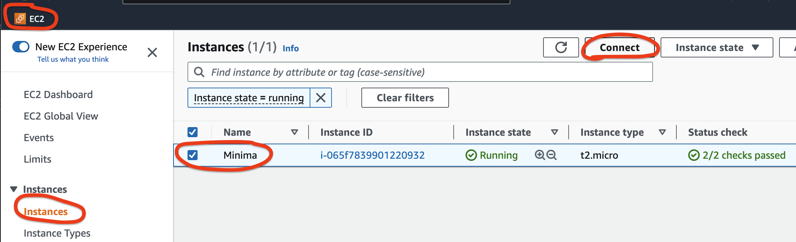

[Introduction](../index.md) > [Step 1](../step1/index.md) > <u>Step 2</u>  > *Step 3* > *Step 4* > *Step 5* > *Step 6*

# Step 2 - Connect to your instance via the AWS Console

Select your new Minima Node instance from the EC2 instance list, and press the connect button.  

A new screen will be shown called Connect to instance.

Check your User name, make sure it is configured to ec2-user 👀. Then, select 👆 the orange Connect button

A new screen will open with a Terminal, allowing your to type commands and control your EC2 instance. 💪

This is where we can install Docker, the install Minima and Watchtower containers. 🦄

[Goto step 3 - Install Docker on your EC2 instance](../step3/index.md)