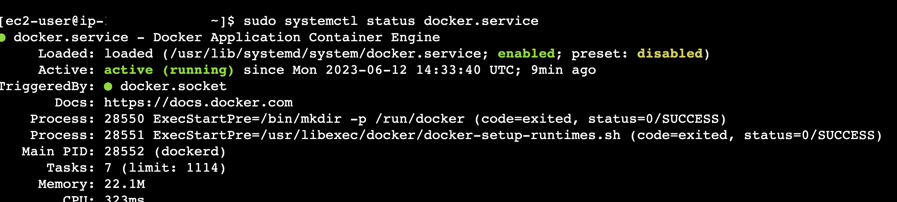

[Introduction](../index.md) > [Step 1](../step1/index.md) > [Step 2](../step2/index.md)  > <u>Step 3</u> > *Step 4* > *Step 5* > *Step 6*

# Step 3 - Install Docker

Installing Docker is straightforward. We can run a few commands to install and keeping Docker running even if you restart your EC2 instance. Below are the 6 commands to achieve those objectives. 

```bash
sudo yum update

sudo yum install docker

sudo addgroup docker

sudo usermod -a -G docker ec2-user sudo systemctl enable docker

sudo systemctl start docker
```

NB:

#1 probably isn’t needed as the Amazon image is kept up to date, but it is a good practice to start there. 

*#2 “yum install docker”* does what is says. When you execute this command the terminal will ask your permission to install. Type y followed by enter key. 

Commands 3-6 are about making sure permissions are correct, making docker a background service, and configuring your system to start docker on startup. 

Nice work! Docker is installed; running; configured as a service which automatically starts when your EC2 instance starts. 

We should run some checks to make sure everything is correct. Type in this command:

systemctl status docker

You should get some output like this [and more] Look out for the text in green: enabled and active (running) 



Press q to quit this command. 

There is a final check if you really want to be sure. Stop and re Start your EC2 instance; reconnect; execute the status command.

systemctl status docker

If all goes to plan you should see the service enabled and running.

[Goto step 4 - Run Minima container](../step4/index.md)