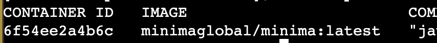

[Introduction](../index.md) > [Step 1](../step1/index.md) > [Step 2](../step2/index.md)  > [Step 3](../step3/index.md) > <u>Step 4</u> > *Step 5* > *Step 6*

# Step 4 - Run Minima container

Next we need to add the Minima container to our Docker service. A container is an isoloated "box" which holds the Minima node, and where it runs, uneffected by anything outside of the its container. 🚢 📦

Another command in our termain will downloading Minima docker container, and starting as a container. 

The command to do this has important aspects and parameters that I’m not covering in this guide. Please refer to the [Minima docs](https://docs.minima.global/docs/runanode/get_started) for complete details of these parameters.

---

In the EC2 terminal, execute the following command. 

```
Before executing this command it is impoart to the mdspassword value to something only you know. 
It should be fairly long [+10 characters] 
Includes a mixture of elements [upper, lower, numbers, but no punctuation.]  
```

`The backslash \ is a convenience to allow this command to correctly span multiple lines for ease of reading. `

```bash
docker run -d --name minimaNode \
-e minima_mdspassword=PasswordsNeed2BLongButEasy2RememberPlsChangeThisValueToSomethingOnlyYouKnow \
-e minima_server=true \
-v ~/minimaNode:/home/minima/data \
-p 8001-8004:9001-9004 \
--restart unless-stopped \
minimaglobal/minima:latest
```
This Docker command will automatically download Minima from the Docker repository. 
Then, create a running container configured as described.

Executing the following command will show Minima running with the latest version.

`docker ps`

A log of running containers will be displayed. Your log should contains something similar to this:



At this stage you have:
* EC2 instance ✅ 
* Docker env        ironment ✅
* Minima node container ✅. 


[Goto step 5 - Run Watchtower container](../step5/index.md)