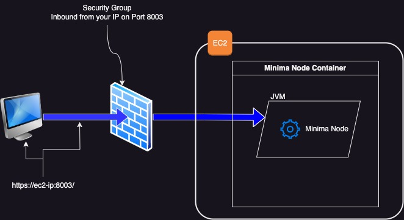
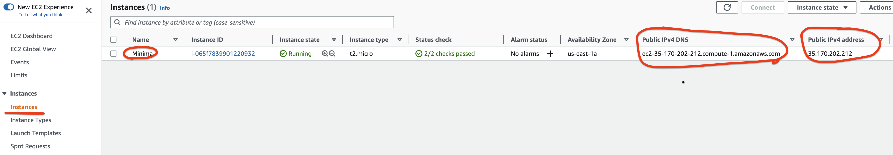

[Introduction](../index.md) > [Step 1](../step1/index.md) > [Step 2](../step2/index.md)  > [Step 2](../step3/index.md) > [Step 4](../step4/index.md) > [Step 5](../step5/index.md) > <u>Step 6</u>

# Step 6 - Access the MDS Hub

If you made it this far, great effort. 


---
Accessing the Minima node MDS Hub via the browser is possible. 



Get the url of your EC2 instance from the AWS Console.



Copy the address and paste it into a browser. Add :8003 to the end of the url before sending. EG. For my demo I would browser to the following address.

`https://ec2-35-170-202-212.compute-1.amazonaws.com:8003/`

After accepting the certificate warning—due to the MDS site have a self signed certificate—you will see the MDS Hub login page.

This access is allowed only from your machine. When you configured your EC2 and added the second security group rule.


```
If you aren't seeing the MDS Hub and the browser timesout, it could mean your IP has changed. Double check by going to the Security Groups in the AWS console and find the Security Group you created, and edit the rule if needed. 
```

This is the End of the guide, but not the end of the journey. Head over the [Minima docs](https://docs.minima.global/docs/runanode/get_started) and learn about securing your node, how to backing up your node, and other important tasks. 


